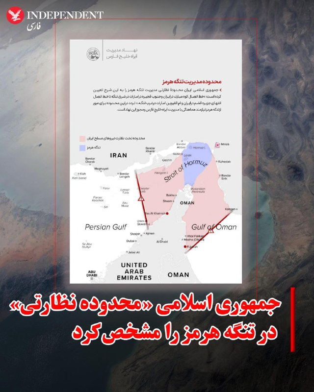
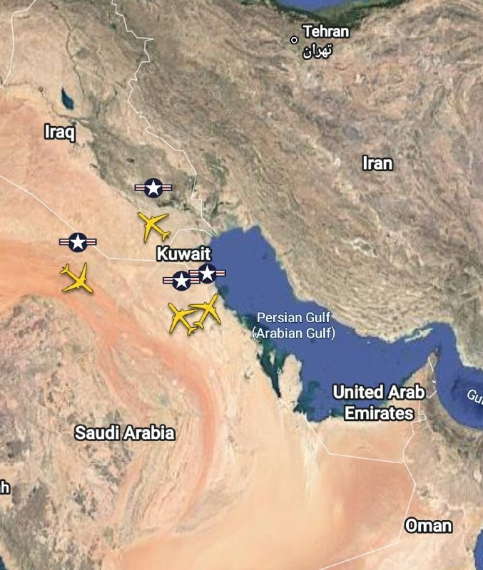
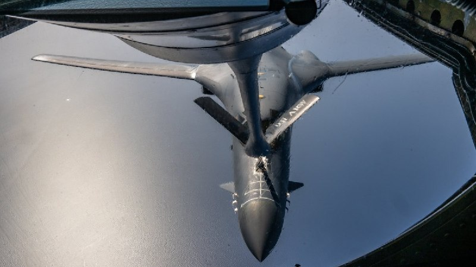
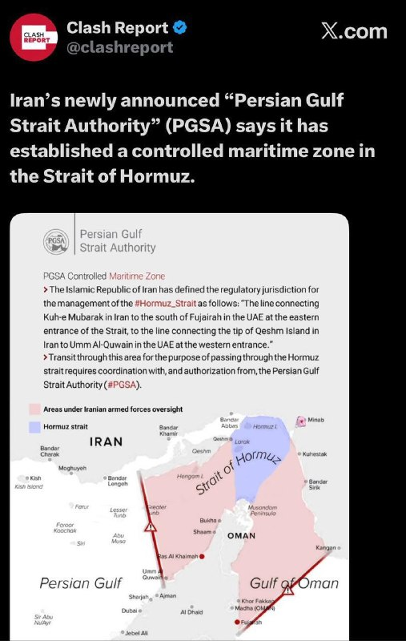
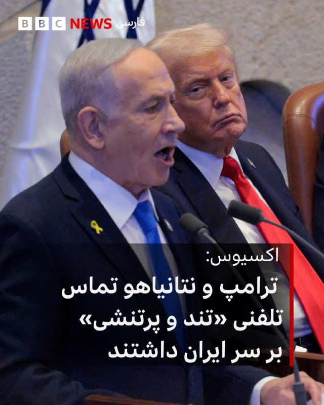

# خواننده تلگرام

<!-- TOP_NAV START -->

<a href="https://github.com/AmizRm/aio-downloader/blob/main/telegram/content/archive_1.md" style="display:inline-block; padding:6px 12px; margin:0 4px; background-color:#2ea44f; color:white; text-decoration:none; border-radius:4px; font-weight:bold;">صفحه بعد</a>

<!-- TOP_NAV END -->

<!-- MSG START -->

---
📅 بروزرسانی: 1405/02/31 02:14
---

## VahidOOnLine — post 241237

  

به گزارش رسانه‌های ایران، چهارشنبه در پی تیراندازی سرنشینان مسلح یک خودروی پژو به خودروی نیروهای انتظامی در یکی از جاده‌های اطراف سراوان، یک نیروی نظامی به نام امیرحسین شهرکی و دو نفر از مهاجمان کشته شدند.
بر اساس این گزارش‌ها، پس از این درگیری، سلاح، مهمات و یک دستگاه استارلینک کشف و خودروی مهاجمان توقیف شد. تلاش‌ها برای شناسایی و بازداشت دیگر مهاجمان ادامه دارد.

‌🏁 🇬🇧 IranintlTV

🤖 @VahidOOnLine

## VahidOOnLine — post 241236

  <a href="telegram/content/VahidOOnLine_241236_1779317058.mp4" target="_blank">🎬 Download video</a>

جاویدنام سینا عباسی؛
جوان ۲۲ ساله‌ای از کرمانشاه که هشتم دی ۱۴۰۴ در جریان اعتراضات میدان انقلاب، بر اثر ضربات باتوم به سر جان باخت.
با گذشت ماه‌ها، هنوز نامش جایی ثبت نشده…
و خانواده‌اش فقط می‌خواهند صدای سینا شنیده شود.»
‌🏁 🇬🇧 ManotoTV

🤖 @VahidOOnLine

## VahidOOnLine — post 241235

  <a href="telegram/content/VahidOOnLine_241235_1779317060.mp4" target="_blank">🎬 Download video</a>

‌
«نهاد مدیریت آبراه خلیج فارس» با انتشار نقشه‌ای در شبکه اکس «محدوده نظارتی مدیریت» جمهوری اسلامی در تنگه هرمز را تعیین کرد.

بر اساس متن این نقشه، محدوده مورد نظر در شرق تنگه از خط اتصال «کوه مبارک» در ایران به جنوب فجیره در امارات متحده عربی، و در غرب تنگه از خط اتصال انتهای جزیره قشم به ام‌القوین در امارات تعیین شده است.

در این بیانیه آمده است تردد در این محدوده برای عبور از تنگه هرمز باید «با هماهنگی مدیریت آبراه خلیج فارس و مجوز این نهاد» انجام شود.

در نقشه منتشرشده، بخش وسیعی از آب‌های اطراف تنگه هرمز (محدوده قرمز) با عنوان «محدوده تحت نظارت نیروهای مسلح ایران» مشخص شده است.
‌🏁 🇬🇧 ManotoTV

🤖 @VahidOOnLine

## VahidOOnLine — post 241234

♦️نارندرا مودی، نخست وزیر هند، با انتشار تصاویری از اجرای رقص پنج زن ایتالیایی در حساب کاربری خود در اکس نوشت: «دیدن علاقه جهانی به فرم‌های رقص هندی واقعا شگفت‌انگیز است.» این هنرمندان ایتالیایی به مناسبت سفر رسمی مودی به رم و برای خوش‌آمدگویی به او، ترکیبی از رقص‌های سنتی «کوچی‌پودی»، «بهاراتاناتیام» و «کاتاک» را اجرا کردند؛ هنرمندانی که پس از این اجرا اعلام کردند احساسات بسیار عمیقی داشتند و مودی نیز شخصا از عملکرد عالی آن‌ها تقدیر کرده است. نخست وزیر هند در بخش دیگری از این سفر دیپلماتیک، به همراه همتای ایتالیایی خود، جورجیا ملونی، از بنای تاریخی کولوسئوم در رم بازدید کرد؛ سفری که ملونی با انتشار پیامی در شبکه اجتماعی اکس و با عبارت «دوست من، به رم خوش آمدی»، استقبال گرمی از آن به عمل آورد. این سفر، نخستین سفر یک نخست‌وزیر هند به ایتالیا در ۲۶ سال گذشته است.
‌🇸🇦 Indypersian

🤖 @VahidOOnLine

## VahidOOnLine — post 241233

  <a href="telegram/content/VahidOOnLine_241233_1779317061.mp4" target="_blank">🎬 Download video</a>

♦️وزارت دفاع بریتانیا چهارشنبه ۳۰ اردیبهشت‌ماه اعلام کرد یک فروند هواپیمای شناسایی «ریوت جوینت» نیروی هوایی سلطنتی در حریم هوایی بین‌المللی بر فراز دریای سیاه با مزاحمت و رهگیری جنگنده‌های روسیه روبه‌رو شده است.

بر اساس بیانیه لندن، جنگنده‌های روسی تا فاصله شش متری به هواپیمای بریتانیایی نزدیک شدند و سامانه‌های اضطراری داخل هواپیما فعال شد.

در تصاویر منتشرشده از سوی وزارت دفاع بریتانیا، جنگنده‌های روسیه در فاصله‌ای بسیار نزدیک کنار هواپیمای شناسایی بریتانیا دیده می‌شوند.

بریتانیا اعلام کرد این هواپیما در حال انجام ماموریتی عادی در حمایت از عملیات ناتو بوده و خدمه آن با وجود «مانورهای بی‌پروا» ماموریت خود را با امنیت کامل به پایان رساندند.

وزارت دفاع بریتانیا همچنین این حادثه را نشانه ادامه افزایش فعالیت‌های نظامی روسیه در اروپای شرقی و مناطق شمالی توصیف کرد.
‌🇸🇦 Indypersian

🤖 @VahidOOnLine

## VahidOOnLine — post 241232

۴۰ روز مادری؛ مراقبت انسانی، نمایش عاطفه و پرسش‌های اخلاقی

نعیمه دوستدار- روایت زنی جوان که برای مدتی کوتاه سرپرستی یک نوزاد را بر عهده داشت، به یکی از بحث‌برانگیزترین موضوعات شبکه‌های اجتماعی فارسی‌زبان تبدیل شد. روایتی که با لحنی احساسی و الهام‌بخش منتشر شد، خیلی زود به موجی از نقدهای اخلاقی، روانشناختی و سیاسی دامن زد.
ماجرا از انتشار روایت‌های سارا کنعانی، فعال فضای مجازی، درباره حضور موقت یک نوزاد در خانه‌اش آغاز شد. او در اینستاگرام و ایکس از تجربه «مادری موقت» نوشت. تجربه‌ای که در قالب طرح «میزبان» سازمان بهزیستی انجام شد.
رسانه‌های حکومتی در ایران، از جمله خبرگزاری جمهوری اسلامی (ایرنا) و روزنامه همشهری، این روایت را با ادبیاتی احساسی و تصویری بازنشر کردند. تصاویری از خانه، آغوش، گریه هنگام جدایی و توصیف‌هایی از «۴۰ روز مادری».
تصاویر بدون حجاب کنعانی در ایرنا منتشر شد و کاربران مدتی بعد خبر از دسترس خارج شدن این خبرگزاری را منتشر کردند.
اما آنچه ابتدا برای بخشی از کاربران تصویری انسانی از مراقبت از کودک بی‌سرپرست به نظر می‌رسید، برای گروهی دیگر به پرسشی جدی درباره مرز میان حمایت از کودک و تبدیل کودک به «محتوا» بدل شد.
https://www.iranintl.com/fa/202605197267

‌🏁 🇬🇧 IranintlTV

🤖 @VahidOOnLine

## VahidOOnLine — post 241231

  

♦️خبرگزاری تسنیم، وابسته به سپاه پاسداران، چهارشنبه‌شب ۳۰ اردیبهشت‌ماه اعلام کرد «نهاد مدیریت آبراه خلیج فارس» محدوده نظارتی جمهوری اسلامی در تنگه هرمز را تعیین کرده است.

بر اساس نقشه منتشرشده، محدوده شرقی این منطقه از خط اتصال «کوه مبارک» در ایران تا جنوب فجیره در امارات متحده عربی و محدوده غربی آن از انتهای جزیره قشم تا ام‌القوین در امارات تعیین شده است.

در متن منتشرشده آمده است عبور از تنگه هرمز در این محدوده باید «با هماهنگی مدیریت آبراه خلیج فارس و مجوز این نهاد» انجام شود.

در نقشه منتشرشده، بخش وسیعی از آب‌های اطراف تنگه هرمز با عنوان «محدوده تحت نظارت نیروهای مسلح جمهوری اسلامی» مشخص شده است.
‌🇸🇦 Indypersian

🤖 @VahidOOnLine

## WithYashar — post 11802

وزیر کشور پاکستان با احمد وحیدی، فرمانده سپاه پاسداران در تهران دیدار کرد.
@withyashar
یکی اینو آخرش از سولاخ کشید بیرون دیگه مابقی با موساده 😅

## mwarmonitor — post 9391

🔴شبکه CBS گزارش داد: کار بر روی تدوین گزینه‌های نظامی علیه کوبا برای رئیس‌جمهور ترامپ آغاز شده و جامعه اطلاعاتی آمریکا در حال بررسی این است که کوبا چگونه ممکن است به یک اقدام نظامی آمریکا واکنش نشان دهد.

@mwarmonitor

## mwarmonitor — post 9390

  

✈️۴ فروند هواپیمای سوخت‌رسان هوایی KC-46A Pegasus نیروی هوایی آمریکا از اسرائیل به پرواز درآمده‌اند و بر اساس داده‌های فلایت‌رادار بر فراز عربستان سعودی و عراق شناسایی شده‌اند.

@mwarmonitor

## mwarmonitor — post 9389

📝 سوال، انتقاد ، پیشنهاد ، دایرکت به گوشم

## mwarmonitor — post 9388

🔴هدف این تلاش جدید این است که تعهدات ملموس‌تری از سوی ایران درباره گام‌های مربوط به برنامه هسته‌ای‌اش به دست آید، و همچنین جزئیات بیشتری از سوی آمریکا درباره این‌که چگونه دارایی‌های مسدودشده ایران به‌تدریج آزاد خواهند شد، ارائه شود؛ یک مقام عربی گفت. باراک راوید

@mwarmonitor

## mwarmonitor — post 9387

🇮🇷🇺🇸ایالات متحده و ایران در حال گفت‌وگو درباره یک «نقشه راه » برای دور جدیدی از مذاکرات هستند که قرار است محورهای مورد بحث را مشخص کند؛ مذاکراتی که ترامپ پیش‌تر گفته بود در اسلام‌آباد برگزار خواهد شد—اگر ایران آماده گفت‌وگو درباره کنار گذاشتن جاه‌طلبی‌های هسته‌ای خود باشد. نیویورک پست

@mwarmonitor

## mwarmonitor — post 9386

  

⁉️سوال زیادی در مورد موقعیت ناو boxer پرسیده بودید

🔸اقیانوس هند
۱۵ می ۲۰۲۶ (۲۵ اردیبهشت ۱۴۰۵)

📷عکس از: سرجوخه ترنت ای. هنری
یگان یازدهم اعزامی تفنگداران دریایی 11th MEU

🔸یک ملوان آمریکایی مستقر در کشتی بالگردبر و آب‌خاکی کلاس واسپ، یو‌اس‌اس باکسر (LHD 4)، در حال نظارت بر یک جنگنده F-35B لایتنینگ ۲ متعلق به اسکادران ۱۲۲ حمله جنگنده‌ای تفنگداران دریایی (VMFA-122)، یگان یازدهم اعزامی تفنگداران دریایی، در جریان عملیات پروازی در اقیانوس هند در تاریخ ۱۵ می ۲۰۲۶ است.

🔸یگان 11th MEU که بر روی ناوگروه آماده آب-خاکی باکسر (Boxer ARG) مستقر شده است، یک نیروی مداوم و با توان رزمی معتبر است که به بازدارندگی و پاسخ به بحران‌ها در منطقه عملیاتی ناوگان هفتم نیروی دریایی آمریکا کمک می‌کند. ناوگان هفتم ایالات متحده، به عنوان بزرگ‌ترین ناوگان شماره‌گذاری‌شده و فرامرزی نیروی دریایی آمریکا، به طور منظم با متحدان و شرکای خود تعامل و عملیات انجام می‌دهد تا امنیت و پایداری یک منطقه آزاد و باز در هند-آرام (ایندو-پاسیفیک) را حفظ کند.

@mwarmonitor

## mwarmonitor — post 9385

  

🔴به نظر می‌رسد نخست وزیر هند در مسیر بازگشت از اروپا، به‌طور کامل از خاورمیانه اجتناب می‌کند. عجیب است که او حتی از حریم هوایی عربستان هم عبور نکرده است.

@mwarmonitor

## mwarmonitor — post 9384

🇺🇸مقامات فدرال آمریکا در حال بررسی معاملاتی مشکوک در بازار نفت به ارزش ۸۰۰ میلیون دلار هستند که درست پیش از انتشار خبرهای مهم مربوط به جنگ ایران انجام شده است؛ موضوعی که یک گزارش آن را فاش کرده است. نیویورک پست

@mwarmonitor

## mwarmonitor — post 9383

🔴فیننشال تایمز: ارزشمندترین شرکت جهان (اینویدیا) پیش‌بینی کرده است که فروش آن در سه‌ماهه جاری به ۹۱ میلیارد دلار برسد؛ رقمی که به‌طور قابل توجهی بالاتر از میانگین انتظار وال‌استریت (۸۶ میلیارد دلار بر اساس داده‌های Visible Alpha) است، اما از خوش‌بینانه‌ترین پیش‌بینی‌ها کمتر است.

@mwarmonitor

## FoxNewsTwitter — post 342028

  <a href="telegram/content/FoxNewsTwitter_342028_1779317066.mp4" target="_blank">🎬 Download video</a>

Fox News (Twitter/X)

WATCH: Boos break out during former Google CEO Eric Schmidt’s commencement speech after he addressed fears about AI reshaping the workforce.

“There is a fear in your generation that the future has already been written... The question is not whether AI will shape the world. It will. The question is whether you will help shape artificial intelligence."

Schmidt said those concerns are “rational” as AI rapidly transforms industries, but pushed graduates to help build the future instead of rejecting the technology outright — prompting audible boos from some in the crowd.

## pm_afshaa — post 91137

  <a href="telegram/content/pm_afshaa_91137_1779317069.webm" target="_blank">🎬 Download video</a>

🔴امروز وزیر کشور پاکستان با احمد وحیدی، فرمانده سپاه پاسداران در تهران دیدار کرد.

💧 Rainbet.com the #1 Non-KYC Crypto Casino & Sportsbook @rainbetcom

😁 @Pm_Afshaa

## pm_afshaa — post 91136

  <a href="telegram/content/pm_afshaa_91136_1779317070.mp4" target="_blank">🎬 Download video</a>

🎙 خبرنگار: پیامت به خانواده‌های آمریکایی که از هوش مصنوعی می‌ترسن چیه؟ اونا نگرانن بچه‌هاشون تو آینده کار نداشته باشن.

جواب کاملا مرتبط و منطقی ترامپ:
هوش مصنوعی فوق‌العاده‌ست و ایران نباید سلاح هسته‌ای داشته باشه!

💧 Rainbet.com the #1 Non-KYC Crypto Casino & Sportsbook @rainbetcom

😁 @Pm_Afshaa

## pm_afshaa — post 91135

  <a href="telegram/content/pm_afshaa_91135_1779317072.webm" target="_blank">🎬 Download video</a>

🔴میدل ایست آی: سه منبع گفتن که انتظار دارن جنگ در هفته‌های آینده و پس از پایان دوره حج، از سر گرفته بشه. آمریکا از سیگنال‌های فریبنده استفاده کرده تا سعی کنه طرف مقابل رو دچار احساس امنیت کاذب کنه. 
💧 Rainbet.com the #1 Non-KYC Crypto Casino & Sportsbook…

## pm_afshaa — post 91134

  <a href="telegram/content/pm_afshaa_91134_1779317073.webm" target="_blank">🎬 Download video</a>

🔴میدل ایست آی: سه منبع گفتن که انتظار دارن جنگ در هفته‌های آینده و پس از پایان دوره حج، از سر گرفته بشه.

آمریکا از سیگنال‌های فریبنده استفاده کرده تا سعی کنه طرف مقابل رو دچار احساس امنیت کاذب کنه.

💧 Rainbet.com the #1 Non-KYC Crypto Casino & Sportsbook @rainbetcom

😁 @Pm_Afshaa

## IranIntlTV — post 338166

  

اسرائیل هیوم به نقل از منابع آگاه گزارش داد جلسه‌ای که چهارشنبه در کاخ سفید درباره ایران برگزار شد، به تنش انجامید، اما ترامپ در نهایت، خلاف نظر وزیران جنگ و خارجه و همسو با دیدگاه جی‌دی ونس و فرستادگان ویژه‌اش، ادامه مذاکرات با جمهوری اسلامی را تایید کرد.
این روزنامه نوشت ارزیابی مارکو روبیو، وزیر امور خارجه، و پیت هگست، وزیر جنگ آمریکا، این بود که در این مرحله، بدون اعمال فشار قابل‌توجه، از جمله تهدید به حمله و تشدید تحریم‌های اقتصادی، نمی‌توان از جمهوری اسلامی امتیاز گرفت. در مقابل، ونس معتقد بود تازه‌ترین پیشنهاد تهران نشانه‌ای از انعطاف است و می‌تواند زمینه حرکت به سوی یک توافق اولیه را فراهم کند.
منابع آگاه از این جلسه به اسرائیل هیوم گفتند که استیو ویتکاف و جرد کوشنر، فرستادگان ویژه دونالد ترامپ نیز در این گفت‌وگو از موضع ونس حمایت کردند.
آنها پیش از این جلسه با رهبران عمان، قطر و عربستان سعودی گفت‌وگو کرده بودند.
به نوشته این رسانه تنش در این جلسه زمانی شدت گرفت که ترامپ از ونس و فرستادگان انتقاد و آنها متهم کرد که رویکردشان به جمهوری اسلامی امکان می‌دهد زمان بخرد و به تصویر ایالات متحده و نهاد ریاست

## IranIntlTV — post 338165

  <a href="telegram/content/IranIntlTV_338165_1779317075.mp4" target="_blank">🎬 Download video</a>

انتشار قانون جدید طالبان درباره طلاق موجی از نگرانی درباره وضعیت حقوق زنان و احتمال تشدید کودک‌همسری در افغانستان ایجاد کرده است.

براساس این قانون، سکوت یک دختر هنگام جاری شدن خطبه عقد، به معنای رضایتش برای ازدواج تلقی می‌شود.

گفت‌وگو با راضیه دانش، عضو تحریریه ایران‌اینترنشنال
@iranintltv

## IranIntlTV — post 338164

  <a href="telegram/content/IranIntlTV_338164_1779317077.mp4" target="_blank">🎬 Download video</a>

مسعود پزشکیان، رییس دولت در جمهوری اسلامی، با تایید آسیب دیدن بخشی از زیرساخت‌های انرژی جمهوری اسلامی در جریان حملات آمریکا و اسرائیل، از ناتوانی دولت در تامین و واردات بنزین خبر داد.

گفت‌وگو با مهدی مصلحی، کارشناس بازار نفت
@iranintltv

## IranIntlTV — post 338163

  <a href="telegram/content/IranIntlTV_338163_1779317080.mp4" target="_blank">🎬 Download video</a>

سنای آمریکا طرح پایان دادن به جنگ با ایران را با ۵۰ رای در برابر ۴۷ رای یک گام به پیش برد.

رسانه‌ها این اقدام را ضربه‌ای سیاسی به دونالد ترامپ توصیف کرده‌اند.

گزارش مرضیه حسینی، خبرنگار ایران‌اینترنشنال
@iranintltv

## IranIntlTV — post 338162

  <a href="telegram/content/IranIntlTV_338162_1779317083.mp4" target="_blank">🎬 Download video</a>

مراد ویسی، تحلیل‌گر ارشد ایران‌اینترنشنال، گفت: «صف بنزین در بندرعباس، شهری که بخش بزرگی از بنزین کشور را تولید می‌کند، نشانه‌ای از شدت گرفتن کمبود بنزین و بحرانی عمیق‌تر از روایت‌ دولت است. در صورت گسترش جنگ و حمله به زیرساخت‌های انرژی، خطر شکل‌گیری ابر بحران بنزین و برق در کشور وجود دارد.»
@iranintltv

## IranIntlTV — post 338161

  <a href="https://t.me/IranintlTV/338161" target="_blank">📎 Download file</a>

🎧نسخه صوتی سیاست با مراد ویسی: چهارمین جنگ یا توافق در آخرین لحظه؟
@iranintlTV

## IranIntlTV — post 338160

  <a href="telegram/content/IranIntlTV_338160_1779317085.mp4" target="_blank">🎬 Download video</a>

آکسیوس گزارش داد دونالد ترامپ در گفت‌وگوی تلفنی با بنیامین نتانیاهو از کار میانجی‌ها روی یک «تفاهم اولیه» خبر داده که قرار است آمریکا و ایران آن را امضا کنند تا جنگ به‌صورت رسمی پایان یابد و دوره ۳۰ روزه مذاکرات آغاز شود.

گفت‌وگو با فرزین ندیمی، پژوهشگر امور دفاعی و امنیتی
@iranintltv

## IranIntlTV — post 338159

  

به گزارش رسانه‌های ایران، چهارشنبه در پی تیراندازی سرنشینان مسلح یک خودروی پژو به خودروی نیروهای انتظامی در یکی از جاده‌های اطراف سراوان، یک نیروی نظامی به نام امیرحسین شهرکی و دو نفر از مهاجمان کشته شدند.
بر اساس این گزارش‌ها، پس از این درگیری، سلاح، مهمات و یک دستگاه استارلینک کشف و خودروی مهاجمان توقیف شد. تلاش‌ها برای شناسایی و بازداشت دیگر مهاجمان ادامه دارد.

https://iranintl.com/202605200267

## IranIntlTV — post 338158

  <a href="telegram/content/IranIntlTV_338158_1779317088.mp4" target="_blank">🎬 Download video</a>

دونالد ترامپ گفت ایران باید تنگه هرمز را باز نگه دارد. او با اشاره به شرایط دشوار زندگی در ایران افزود خشم و ناآرامی زیادی در کشور وجود دارد.

همزمان آکسیوس گزارش داد تماس تلفنی ترامپ و نتانیاهو درباره جمهوری اسلامی پرتنش بوده است.

گزارش اردوان روزبه، خبرنگار ایران‌اینترنشنال
@iranintltv

## IranIntlTV — post 338157

  <a href="telegram/content/IranIntlTV_338157_1779317091.mp4" target="_blank">🎬 Download video</a>

مراد ویسی، تحلیل‌گر ارشد ایران‌اینترنشنال، گفت: «تشکیل تدریجی صف برای برخی کالاها، از جمله بنزین و نان، در شهرهای مختلف به مساله‌ای تازه در زندگی روزمره مردم تبدیل شده، صف‌هایی که نشانه کمبود و اختلال در تامین برخی کالاها پس از جنگ اخیر هستند. گزارش‌هایی از شهرهایی مانند اصفهان، مشهد، بندرعباس و اراک از طولانی شدن صف بنزین و نان و مشکلات تأمین بنزین و آرد خبر می‌دهد.»
@iranintltv

## IranIntlTV — post 338156

  <a href="telegram/content/IranIntlTV_338156_1779317093.mp4" target="_blank">🎬 Download video</a>

مراد ویسی، تحلیل‌گر ارشد ایران‌اینترنشنال، گفت: «ترامپ گفته فقط چند روز دیگر برای توافق با جمهوری اسلامی فرصت خواهد داد. او گفته الان سوال اصلی این است که جمهوری اسلامی سند توافق را امضا خواهد کرد یا ما کار را تمام خواهیم کرد. طبق گفته ترامپ همه چیز باید تا یکشنبه روشن شود اما تجارب تاریخی نشان داده سیاست بالا و پایین بسیار دارد.»
@iranintltv

## IranIntlTV — post 338155

۴۰ روز مادری؛ مراقبت انسانی، نمایش عاطفه و پرسش‌های اخلاقی

نعیمه دوستدار- روایت زنی جوان که برای مدتی کوتاه سرپرستی یک نوزاد را بر عهده داشت، به یکی از بحث‌برانگیزترین موضوعات شبکه‌های اجتماعی فارسی‌زبان تبدیل شد. روایتی که با لحنی احساسی و الهام‌بخش منتشر شد، خیلی زود به موجی از نقدهای اخلاقی، روانشناختی و سیاسی دامن زد.
ماجرا از انتشار روایت‌های سارا کنعانی، فعال فضای مجازی، درباره حضور موقت یک نوزاد در خانه‌اش آغاز شد. او در اینستاگرام و ایکس از تجربه «مادری موقت» نوشت. تجربه‌ای که در قالب طرح «میزبان» سازمان بهزیستی انجام شد.
رسانه‌های حکومتی در ایران، از جمله خبرگزاری جمهوری اسلامی (ایرنا) و روزنامه همشهری، این روایت را با ادبیاتی احساسی و تصویری بازنشر کردند. تصاویری از خانه، آغوش، گریه هنگام جدایی و توصیف‌هایی از «۴۰ روز مادری».
تصاویر بدون حجاب کنعانی در ایرنا منتشر شد و کاربران مدتی بعد خبر از دسترس خارج شدن این خبرگزاری را منتشر کردند.
اما آنچه ابتدا برای بخشی از کاربران تصویری انسانی از مراقبت از کودک بی‌سرپرست به نظر می‌رسید، برای گروهی دیگر به پرسشی جدی درباره مرز میان حمایت از کودک و تبدیل کودک به «محتوا» بدل شد.

https://www.iranintl.com/fa/202605197267

## Shin_Persian — post 6119

  

U.S. Central Command ✓ @CENTCOM
Wed, 20 May 2026 22:20:46 UTC

A U.S. Air Force B-1B Lancer refuels from a KC-135 Stratotanker during a training flight over regional waters in the Middle East.

فارسی

یک فروند بی-۱بی لنسر نیروی هوایی ایالات متحده (USAF) در جریان یک پرواز آموزشی بر فراز آب‌های منطقه در خاورمیانه، از یک کی‌سی-۱۳۵ استراتوتانکر سوخت‌گیری می‌کند.

𝕏 · @shin_persian

## Shin_Persian — post 6118

Shin ✓ @hey_itsmyturn
Wed, 20 May 2026 22:03:08 UTC

Jet activity over Daraa, #Syria 🇸🇾

فارسی

فعالیت جت‌ها برفراز درعا، #Syria 🇸🇾

𝕏 · @shin_persian

## ManotoTV — post 105706

  <a href="telegram/content/ManotoTV_105706_1779317097.mp4" target="_blank">🎬 Download video</a>

جاویدنام سینا عباسی؛
جوان ۲۲ ساله‌ای از کرمانشاه که هشتم دی ۱۴۰۴ در جریان اعتراضات میدان انقلاب، بر اثر ضربات باتوم به سر جان باخت.
با گذشت ماه‌ها، هنوز نامش جایی ثبت نشده…
و خانواده‌اش فقط می‌خواهند صدای سینا شنیده شود.»

## ManotoTV — post 105705

  <a href="telegram/content/ManotoTV_105705_1779317099.mp4" target="_blank">🎬 Download video</a>

‌
«نهاد مدیریت آبراه خلیج فارس» با انتشار نقشه‌ای در شبکه اکس «محدوده نظارتی مدیریت» جمهوری اسلامی در تنگه هرمز را تعیین کرد.

بر اساس متن این نقشه، محدوده مورد نظر در شرق تنگه از خط اتصال «کوه مبارک» در ایران به جنوب فجیره در امارات متحده عربی، و در غرب تنگه از خط اتصال انتهای جزیره قشم به ام‌القوین در امارات تعیین شده است.

در این بیانیه آمده است تردد در این محدوده برای عبور از تنگه هرمز باید «با هماهنگی مدیریت آبراه خلیج فارس و مجوز این نهاد» انجام شود.

در نقشه منتشرشده، بخش وسیعی از آب‌های اطراف تنگه هرمز (محدوده قرمز) با عنوان «محدوده تحت نظارت نیروهای مسلح ایران» مشخص شده است.

## FarsiVOA — post 218260

🔺آمریکا علیه رهبر سابق کوبا کیفرخواست صادر کرد؛ رائول کاسترو متهم به قتل شد

▪️دادستان‌های فدرال آمریکا روز چهارشنبه اعلام کردند که علیه رائول کاسترو، رئیس‌جمهوری پیشین کوبا، به اتهام نقش داشتن در سرنگونی هواپیماهای غیرنظامی در سال ۱۹۹۶ پرونده کیفری تشکیل داده‌اند. این هواپیماها مورد استفاده تبعیدی‌هایی کوبایی‌تبار ساکن میامی در آمریکا بود.

⬇️ بیشتر بخوانید:
https://ir.voanews.com/a/8152139.html
@FarsiVOA

## FarsiVOA — post 218259

🔺وزیر خزانه‌داری آمریکا با وزیر دارایی قطر در مورد لزوم حفظ فشار بر جمهوری اسلامی صحبت کرد

▪️وزیر خزانه‌داری آمریکا، اسکات بسنت، روز چهارشنبه ۳۰ اردیبهشت اعلام کرد که با وزیر علی احمد الکواری وزیر دارایی قطر در پاریس دیدار و گفت‌وگو کرده است.

⬇️ بیشتر بخوانید:
https://ir.voanews.com/a/8152133.html
@FarsiVOA

## Persian_Trend_Official — post 14564

  <a href="telegram/content/Persian_Trend_Official_14564_1779317100.mp4" target="_blank">🎬 Download video</a>

▪️شبی پر از آرامش برای شما آرزومندم 🫶

🫆:Tony

📌 @persian_trend_official
پرشین ترند | متفاوت‌ترین کانال نظامی

## Persian_Trend_Official — post 14563

⭕️ رائول کاسترو متهم به قتل شد 💢دادستان‌های فدرال آمریکا روز چهارشنبه اعلام کردند که علیه رائول کاسترو، رئیس‌جمهوری پیشین کوبا، به اتهام نقش داشتن در سرنگونی هواپیماهای غیرنظامی در سال ۱۹۹۶ پرونده کیفری تشکیل داده‌اند. این هواپیماها مورد استفاده تبعیدی‌هایی…

## Persian_Trend_Official — post 14562

  <a href="telegram/content/Persian_Trend_Official_14562_1779317102.webm" target="_blank">🎬 Download video</a>

⭕️ رائول کاسترو متهم به قتل شد

💢دادستان‌های فدرال آمریکا روز چهارشنبه اعلام کردند که علیه رائول کاسترو، رئیس‌جمهوری پیشین کوبا، به اتهام نقش داشتن در سرنگونی هواپیماهای غیرنظامی در سال ۱۹۹۶ پرونده کیفری تشکیل داده‌اند. این هواپیماها مورد استفاده تبعیدی‌هایی کوبایی‌تبار ساکن میامی در آمریکا بود.

🫆:Tony

📌 @persian_trend_official
پرشین ترند | متفاوت‌ترین کانال نظامی

## Persian_Trend_Official — post 14561

  <a href="telegram/content/Persian_Trend_Official_14561_1779317103.webm" target="_blank">🎬 Download video</a>

نسخه صوتی لایو امشب در اسپاتیفای : https://open.spotify.com/episode/4ZyN11ARn9PzPUowsFbzbh?si=w_I-pR9MRMyUKElfOPbe8Q

## Persian_Trend_Official — post 14560

  

🔴 هالیوود فیلمی درباره عملیات نجات خلبانان آمریکایی در ایران می‌سازد

💢به گزارش ددلاین، استودیوی «یونیورسال پیکچرز» و «مایکل بی» کارگردان مشهور آمریکایی، در حال ساخت فیلمی درباره نجات دو نیروی هوایی آمریکا در ایران پس از سرنگونی جنگنده F-15E Strike Eagle آن‌ها در جریان عملیات «خشم حماسی» هستند.

🔻بر اساس این گزارش:

▪️ فیلم بر پایه کتابی از «میچل زاکف» که قرار است در سال ۲۰۲۷ منتشر شود ساخته خواهد شد
▪️ مایکل بی اعلام کرده طی سال‌های فعالیتش همکاری «شگفت‌انگیزی» با وزارت جنگ آمریکا و ارتش این کشور داشته است
▪️ این موضوع احتمال همکاری مستقیم پنتاگون با پروژه را تقویت می‌کند

مایکل بی درباره این پروژه گفت:

▪️ فیلم روی نیروهایی تمرکز دارد که یکی از «پیچیده‌ترین و پرریسک‌ترین عملیات‌های تاریخ معاصر» را انجام داده‌اند

🫆:Tony

📌 @persian_trend_official
پرشین ترند | متفاوت‌ترین کانال نظامی

## IranianMinds — post 20470

  

🔴نهاد مدیریت آبراه خلیج ‌فارس که به تازگی اعلام موجودیت کرده است، می‌گوید یک منطقه دریایی کنترل شده در تنگه هرمز ایجاد کرده است.

@IranianMinds

## BBCPersian — post 281648

  

🔻پدرو سانچز، نخست‌وزیر اسپانیا، در واکنشی تند به برخورد تند و خشن وزیر امنیت ملی اسرائیل با فعالان ناوگان بشردوستانه غزه گفته تلاش خواهد کرد اتحادیه اروپا را برای تحریم برخی از اعضای تندور دولت اسرائیل، مجاب کند.

آقای سانچز روز چهارشنبه در حساب ایکس خود نوشت:

«تصاویر مربوط به تحقیر اعضای ناوگان بین‌المللی حامی غزه توسط وزیر اسرائیلی، بن گویر، غیرقابل قبول است. ما تحمل نخواهیم کرد که با شهروندان‌مان بدرفتاری شود. در ماه سپتامبر، ممنوعیت ورود این عضو دولت اسرائیل به خاک کشورمان را اعلام کردم. اکنون نیز در بروکسل تلاش خواهیم کرد این تحریم‌ها در سریع‌ترین زمان ممکن به سطح اتحادیه اروپا گسترش یابد.»

📸EPA/Shutterstock
https://bbc.in/4dViGx1
@BBCPersian

## BBCPersian — post 281646

🔻قاآنی: جنگ باعث شد اسرائیل سریع‌تر به «نقطه پایان نزدیک شود»

اسماعیل قاآنی، فرمانده نیروی قدس سپاه پاسداران در اظهاراتی جدید که خبرگزاری‌های نزدیک به سپاه منتشر کرده‌اند به تحولات روز واکنش نشان داده است از جمله به حرکت ناوگان بشردوستانه به سمت غزه که متوقف کردن آن و برخورد خشن و تحقیر آمیز وزیر امنیت ملی اسرائیل با یکی از دهها فعال ناوگان صمود آن امروز خبر ساز شده است.

آقای قاآنی گفته آنچه او دستاورهای ناوگان صمود خوانده «ادامه» خواهد داشت و از نظر او: «فلسطین را باز به کانون توجه جهانیان بازگرداند. رژیم صهیونسیتی مغلوب را که به تشدید سرکوب و جنایاتگری دست زده، سریعتر از قبل به نقطه پایان نزدیک کرد.»

نیروی قدس سپاه پاسداران که پیش از آقای قاآنی، قاسم سلیمانی برای سالها فرماندهی آن را در دست داشت، شاخه برون مرزی سپاه پاسداران است و بازوری اصلی حکومت در ایران برای هماهنگی و کنترل و حمایت از نیروهای نیابتی آن در منطقه محسوب می‌شود.

این بخش از سپاه پاسداران از سال‌ها قبل در فهرست سازمان‌های تروریستی آمریکا و چند کشور غربی دیگر قرار گرفته است.

https://bbc.in/4upkbJS
@BBCPersian

## BBCPersian — post 281645

  

🔻نشریه آمریکایی اکسیوس از تماس تلفنی روز گذشته - سه‌شنبه ۲۹ اردیبهشت - میان دونالد ترامپ و بنیامین نتانیاهو بر سر ایران خبر داده که به نوشته این رسانه، «پرتنش» بوده و نخست‌وزیر اسرائیل را «بسیار برآشفته» است.

باراک راوید، خبرنگار اکسیوس در گزارش روز چهارشنبه خود نوشته که این اطلاعات را سه منبع مطلع دریافت کرده است هر چند نام آنها را ذکر نکرده است.

به گفته این باراک راوید: «بنیامین نتانیاهو نسبت به مذاکرات به‌شدت بدبین است و خواهان ازسرگیری جنگ برای تضعیف بیشتر توانایی‌های نظامی ایران و ضربه زدن به حکومت از طریق نابودی زیرساخت‌های حیاتی آن است.»

بر اساس آنچه اکسیوس گزارش کرده در برابر این موضع نخست‌وزیر اسرائیل، دونالد ترامپ «معتقد است که امکان دستیابی به توافق وجود دارد، اما اگر چنین توافقی حاصل نشود، آماده ازسرگیری جنگ است.»

📸GettyImages
https://bbc.in/49Zp2sK
@BBCPersian

## Dirty_Kids — post 389855

  <a href="telegram/content/Dirty_Kids_389855_1779317107.webm" target="_blank">🎬 Download video</a>

☢️خفن ترین و‌ قدیمی ترین  انالیزور  ایران ینی دکتر بت 
👍 
🔴هیچ سایت بتی دوست نداره شما کانال دکتر بت رو پیدا کنین چون خیلی سود میکنید🤷‍♂ رایگان بهترین شرط هارو براتون میذاره حتی هزار تومن هم دریافت نمیکنه روزانه میتونی از پیش بینی فوتبال باهاش پول در بیاری…

## Dirty_Kids — post 389854

  <a href="telegram/content/Dirty_Kids_389854_1779317108.webm" target="_blank">🎬 Download video</a>

☢️خفن ترین و‌ قدیمی ترین  انالیزور  ایران ینی دکتر بت 
👍

🔴هیچ سایت بتی دوست نداره شما کانال دکتر بت رو پیدا کنین چون خیلی سود میکنید🤷‍♂

رایگان بهترین شرط هارو براتون میذاره
حتی هزار تومن هم دریافت نمیکنه
روزانه میتونی از پیش بینی فوتبال باهاش پول در بیاری 👌
A30
اگ اهل پیش بینی فوتبالی این کانال اصلا از دست ندین👇

✅https://t.me/+4_ADqwB9e-QwYjlk

✅https://t.me/+4_ADqwB9e-QwYjlk

## Dirty_Kids — post 389853

  

#بخوابیم

@Dirty_Kids 👻

## Dirty_Kids — post 389852

این خبر احمدی‌نژاد یه چیزی تو مایه‌های ماجرای مهران مدیری بود که با قایق رفته بود دنبال علی کریمی.

@Dirty_Kids 👻

## Dirty_Kids — post 389851

دیگه چیزی‌ نمونده که جوون ایرانی تجربه نکرده باشه جز یک چیز. شادی. شادی رو هنوز تجربه نکردیم.

@Dirty_Kids 👻

## Dirty_Kids — post 389850

  <a href="telegram/content/Dirty_Kids_389850_1779317109.mp4" target="_blank">🎬 Download video</a>

ازدواج آسان

اینا اصلا موشعلی و مقوایی اینارو یادشون رفته
افتادن به مقاومت جنسی.
فکر کن هر شب میرن پرچم تکون میدن واسه پایین تنه.🤣🤣

@Dirty_Kids 👻

## Dirty_Kids — post 389849

  <a href="telegram/content/Dirty_Kids_389849_1779317112.mp4" target="_blank">🎬 Download video</a>

مود: 🦦

@Dirty_Kids 👻

## Dirty_Kids — post 389848

  

🔴 طبق مطالعات جدید کسایی که دائم از بقیه غلط املایی میگیرن، دچار اختلال روانی ان.

@Dirty_Kids 👻

## Dirty_Kids — post 389847

  <a href="telegram/content/Dirty_Kids_389847_1779317115.mp4" target="_blank">🎬 Download video</a>

این صحبت ترامپ ارزش داره چندین بار ببینیش:

@Dirty_Kids 👻

## Dirty_Kids — post 389846

  

سرانجام بخت زیبای خفته‌ی عرزشی‌ها هم باز شد @Dirty_Kids 👻

## Dirty_Kids — post 389845

  <a href="telegram/content/Dirty_Kids_389845_1779317118.mp4" target="_blank">🎬 Download video</a>

سرانجام بخت زیبای خفته‌ی عرزشی‌ها هم باز شد

@Dirty_Kids 👻

## Dirty_Kids — post 389841

حاصل خالی گذاشتن سکوهای ورزشگاه جام جهانی قطر شد:
حضور ‎#پرستوهای_رژیم به اسم «نماینده ی ملت ایران» با هد بند و پرچم!
آخوندها هم به دنیا گفتند: ببینید مردم ایران چقدر آزادند و حامی و دوستدار حکومت میباشند!!

تبلیغات جمهوری اسلامی در جام جهانی قطر دقیقا ۴ سال جنایت و فلاکت و شکنجه و غارت ایران و همچنین ۴۰ هزار کشته فقط در ۲ روز واسمون هزینه ایجاد کرد!!
این بار فریب نخوریم و با برنامه پیش بریم.

@Dirty_Kids 👻

## Dirty_Kids — post 389840

  <a href="telegram/content/Dirty_Kids_389840_1779317120.mp4" target="_blank">🎬 Download video</a>

چالش "دوربین‌به‌کون" هم تازه راه افتاده

@Dirty_Kids 👻

## manototv — post 105706

  <a href="telegram/content/manototv_105706_1779317122.mp4" target="_blank">🎬 Download video</a>

جاویدنام سینا عباسی؛
جوان ۲۲ ساله‌ای از کرمانشاه که هشتم دی ۱۴۰۴ در جریان اعتراضات میدان انقلاب، بر اثر ضربات باتوم به سر جان باخت.
با گذشت ماه‌ها، هنوز نامش جایی ثبت نشده…
و خانواده‌اش فقط می‌خواهند صدای سینا شنیده شود.»

## manototv — post 105705

  <a href="telegram/content/manototv_105705_1779317124.mp4" target="_blank">🎬 Download video</a>

‌
«نهاد مدیریت آبراه خلیج فارس» با انتشار نقشه‌ای در شبکه اکس «محدوده نظارتی مدیریت» جمهوری اسلامی در تنگه هرمز را تعیین کرد.

بر اساس متن این نقشه، محدوده مورد نظر در شرق تنگه از خط اتصال «کوه مبارک» در ایران به جنوب فجیره در امارات متحده عربی، و در غرب تنگه از خط اتصال انتهای جزیره قشم به ام‌القوین در امارات تعیین شده است.

در این بیانیه آمده است تردد در این محدوده برای عبور از تنگه هرمز باید «با هماهنگی مدیریت آبراه خلیج فارس و مجوز این نهاد» انجام شود.

در نقشه منتشرشده، بخش وسیعی از آب‌های اطراف تنگه هرمز (محدوده قرمز) با عنوان «محدوده تحت نظارت نیروهای مسلح ایران» مشخص شده است.

## alonews — post 121450

  <a href="telegram/content/alonews_121450_1779317125.webm" target="_blank">🎬 Download video</a>

👈یدیعوت آحارونوت: مقامات اسرائیل از اقدامات ترامپ راضی نیستند

✅ @AloNews خبر جنگ

## alonews — post 121448

  <a href="telegram/content/alonews_121448_1779317125.webm" target="_blank">🎬 Download video</a>

👈کانال 14 اسرائیل: ایران و ایالات متحده امشب از طریق واسطه‌های پاکستانی نزدیک‌ترین پیش‌نویس‌های پیشنهادی خود را مبادله کردند. هر دو کشور فردا جزئیات را بررسی خواهند کرد

✅ @AloNews خبر جنگ

## alonews — post 121445

  <a href="telegram/content/alonews_121445_1779317126.webm" target="_blank">🎬 Download video</a>

👈کلاهبرداری صرافی #رمزینکس
⁉️

🔴پیام مخاطب:

با سلام
من در تاریخ ۶ فروردین ۳۰۰ ملیون معامله اهرمی در نماد تتر گلد صرافی رمزینکس داشتم در عرض چند ثانیه قیمت از ۱۷هزار به یک هزار سقوط کرد و دوباره برگشت همه معاملات اهرمی پودر شدند با پشتیبانی هرچقدر پیگیری کردیم آخرش میگن که شما ریسک معاملاتی رو پذیرفته اید یا بعضا قبول میکنن قصوراتشون رو ولی جبران خسارت نمیکنن خواهشا اطلاع رسانی کنید تا بقیه تو دام این کلاهبرداران کثیف نیوفتن وسط جنگ از این شرایط سو استفاده میکنن و پول ملت رو بالا میکشن و هیچ مسؤولیتی رو گردن نمیگیرن.

🔴این اقدام صرافی رمزینکس مصداق بارز اخلال در نظام اقتصادی و سواستفاده از شرایط جنگی است

✅ @AloNews خبر جنگ

## alonews — post 121444

  <a href="telegram/content/alonews_121444_1779317126.webm" target="_blank">🎬 Download video</a>

👈دوستان این تبلیغاتی که پائین کانال نمایش داده میشه توسط تلگرامه و دست ما نیست و کلاهبرداری هست و فریب نخورید

✅ @AloNews خبر جنگ

## alonews — post 121443

  <a href="telegram/content/alonews_121443_1779317126.mp4" target="_blank">🎬 Download video</a>

👈شاخص پیتزا تو اطراف پنتاگون رفت بالا

✅ @AloNews خبر جنگ

## alonews — post 121442

  <a href="telegram/content/alonews_121442_1779317128.mp4" target="_blank">🎬 Download video</a>

👈خبرنگار: پیامت به خانواده‌های آمریکایی که از هوش مصنوعی می‌ترسن چیه؟ اونا نگرانن بچه‌هاشون تو آینده کار نداشته باشن.

🔴جواب کاملا مرتبط و منطقی ترامپ:
ایران نباید سلاح هسته‌ای داشته باشه!

✅ @AloNews خبر جنگ

## alonews — post 121441

  <a href="telegram/content/alonews_121441_1779317130.mp4" target="_blank">🎬 Download video</a>

👈 وزیر بهداشت و خدمات انسانی آر‌اف‌کِی جونیور: من همیشه در اطراف دختران جوان زیادی هستم و همه آنها در آن بخش از زندگی خود واقعا دیوانه به نظر می رسند

✅ @AloNews خبر جنگ

## alonews — post 121440

  <a href="telegram/content/alonews_121440_1779317132.webm" target="_blank">🎬 Download video</a>

👈بزرگترین کشتی جنگی ژاپن برای آموزش F-35B با تفنگداران دریایی آمریکا آماده میشه - USNI

✅ @AloNews خبر جنگ

## alonews — post 121439

  <a href="telegram/content/alonews_121439_1779317133.webm" target="_blank">🎬 Download video</a>

👈وزیر امور خارجه مارکو روبیو:
اشتباهی نباشد: ایالات متحده به طور قاطع از دولت قانونی و قانون اساسی بولیوی حمایت می‌کند.

🔴ما اجازه نخواهیم داد که جنایتکاران و قاچاقچیان مواد مخدر رهبران منتخب دموکراتیک در نیمکره ما را سرنگون کنند.

✅ @AloNews خبر جنگ

<!-- MSG END -->

<!-- NAV START -->

<a href="https://github.com/AmizRm/aio-downloader/blob/main/telegram/content/archive_1.md" style="display:inline-block; padding:6px 12px; margin:0 4px; background-color:#2ea44f; color:white; text-decoration:none; border-radius:4px; font-weight:bold;">صفحه بعد</a>

<!-- NAV END -->
